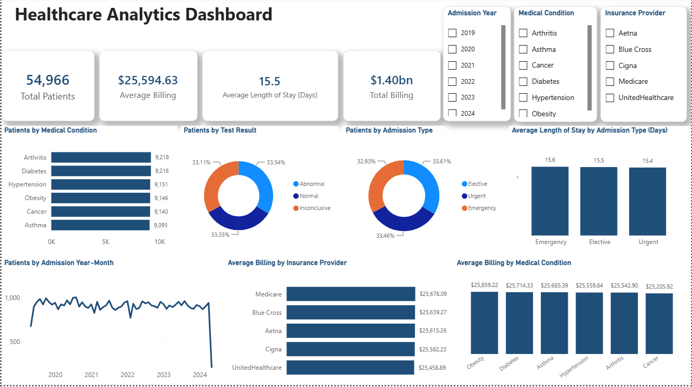

# Healthcare Analytics Project

## Project Overview

This project presents an end-to-end analysis of a healthcare dataset to explore patient demographics, admission patterns, medical conditions, billing, and length of stay.

The project demonstrates a complete data analytics workflow using **Python, SQL, and Power BI**, from data cleaning and exploratory analysis to querying, visualization, and reporting.

## Tools Used

- **Python** – Data cleaning, transformation, exploratory data analysis, and visualization
- **Pandas** – Data manipulation and analysis
- **Matplotlib & Seaborn** – Data visualization
- **SQL** – Data querying and analytical exploration
- **Power BI** – Interactive dashboard development and data visualization

## Dataset

The original healthcare dataset was sourced from **Kaggle** and contains patient-level information including:

- Age and gender
- Blood type
- Medical condition
- Admission type
- Admission and discharge dates
- Insurance provider
- Billing amount
- Medication
- Test results

The original dataset contained approximately **55,500 records**. After data cleaning and duplicate removal, the final dataset contained **54,966 records**.

Both the original and cleaned datasets are available in the [`data`](data/) folder.

## Project Workflow

### 1. Python – Data Cleaning & Exploratory Data Analysis

Python was used to inspect, clean, transform, and explore the healthcare dataset.

Key tasks included:

- Inspecting dataset structure and data types
- Identifying and removing duplicate records
- Checking missing values
- Investigating billing values
- Converting admission and discharge dates
- Creating a **Length of Stay** variable
- Analysing patient demographics
- Exploring medical conditions and admission types
- Analysing billing and length-of-stay patterns
- Creating exploratory visualizations

The complete Python notebook is available in the [`python`](python/) folder.

### 2. SQL Analysis

SQL was used to further analyse the cleaned healthcare dataset and answer analytical questions related to:

- Patient demographics
- Admission patterns
- Medical conditions
- Billing
- Insurance providers
- Length of stay

The SQL queries are available in the [`sql`](sql/) folder.

### 3. Power BI Dashboard

An interactive Power BI dashboard was developed to present the major healthcare metrics and findings.

The dashboard includes:

- Total Patients
- Total Billing
- Average Billing
- Average Length of Stay
- Patients by Medical Condition
- Patients by Test Result
- Patients by Admission Type
- Average Length of Stay by Admission Type
- Patient Admission Trends
- Average Billing by Insurance Provider
- Average Billing by Medical Condition
- Interactive filters for year, medical condition, and insurance provider

The Power BI file is available in the [`powerbi`](powerbi/) folder.

## Dashboard

## Key Findings

- The cleaned dataset contains **54,966 patient records**.
- The average patient billing amount is approximately **$25,595**.
- Total billing across the dataset is approximately **$1.40 billion**.
- Average length of stay is approximately **15.5 days**.
- Arthritis and Diabetes have the highest patient counts among the medical conditions analysed.
- Elective, Urgent, and Emergency admissions are distributed relatively evenly.
- Average length of stay is similar across the three admission types.
- Average billing is relatively consistent across insurance providers and medical conditions.

## Repository Structure

Healthcare-Analytics/
- `data/` – Original and cleaned healthcare datasets
- `python/` – Python notebook containing data cleaning and exploratory analysis
- `sql/` – SQL queries used for analysis
- `powerbi/` – Power BI dashboard file
- `images/` – Dashboard screenshot
- `reports/` – Project analysis report in PDF and Word formats

## Project Report

A detailed project report covering the analysis, methodology, dashboard findings, and key insights is available in the [`reports`](reports/) folder.

## Author

**Nikhil Kumar**

Master of Business Analytics – Supply Chain & Logistics 
